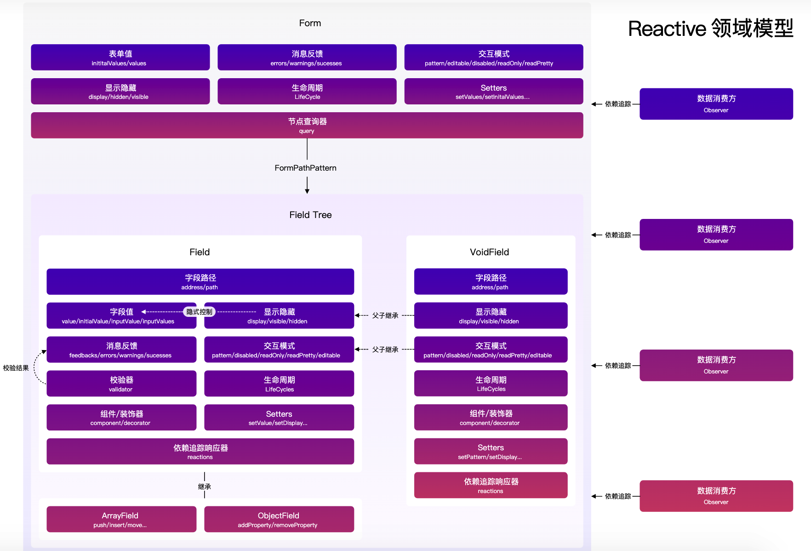

# @formily/core

> 核心意义是将领域模型从 UI 框架中抽离出来

[core 官网](https://core.formilyjs.org/zh-CN)

- 可以方便 formily 开发者从 UI 与逻辑的耦合关系中释放出来，提升代码可维护性
- 让 formily 拥有跨终端，跨框架的能力，不管你是 React 用户，Vue 用户还是 Angular 用户，都能享受到 formily 的领域模型带来的提效。

## 表单模型

**表单问题**分解成各个领域问题：

- 数据管理问题
- 字段管理问题
- 校验管理问题
- 联动管理问题

### 字段管理模型

- 字段添加

主要通过 `createField/createArrayField/createObjectField/createVoidField` 方法来创建字段，如果字段已经存在，则不会重复创建

- 字段查询

主要通过`query`传入字段路径或正则表达式来匹配字段，返回`Query`对象，含有一些方法可以获取、遍历字段等

- 导入字段集

主要通过 `setFormGraph` 来导入字段集，入参格式是一个扁平对象格式，`key` 是字段的绝对路径，`value` 是字段的状态、值

- 导出字段集

通过 `getFormGraph` 来导出字段集

- 清空字段集

主要通过 `clearFormGraph` 来清空字段集

### 字段模型

读取数据，顶层操作表单数据

- `Field` 模型，主要负责管理非自增型字段状态，比如 Input/Select/NumberPicker/DatePicker 这些组件
- `ArrayField` 模型，主要负责管理自增列表字段状态，可以对列表项进行增删移动的。
- `ObjectField` 模型，主要负责管理自增对象字段状态，可以对对象的 key 做增删操作。
- `VoidField` 模型，主要负责管理虚字段状态，虚字段是一种不会污染表单数据的节点存在，但是它可以控制它的子节点**显示隐藏，交互模式**。

ArrayField 和 ObjectField 都是继承自 Field，Field 的定位就是维护非自增型数据字段，对比 ArrayField/Object，并不是说 Field 就不能存数组类型或者对象类型的数据，Field 其实可以存任意数据类型的数据，只是，如果用户期望实现数组的添加删除移动这样的交互，则需要使用 ArrayField，对象属性的添加删除交互，则需要使用 ObjectField，如果没有这样的需求，所有数据类型统一用 Field 即可。

### 数据模型

- 表单值(values)管理，发生变化，便会触发 onFormValuesChange 的生命周期钩子。
- 表单默认值(initialValues)管理，发生变化，便会触发 onFormValuesChange 的生命周期钩子。
- 字段值(value)管理，值的管理，都是在顶层表单上管理的，字段的值与表单的值是通过 path 来实现的绝对幂等
- 字段默认值(initialValue)管理
- 值与默认值的选择合并策略，核心是看该字段是否被用户修改过，一切以用户为准，如果没被用户修改过就以赋值顺序为准

### 校验模型

- 校验规则管理
  - 校验器
  - 校验时机
  - 校验策略
  - 校验结果

- 校验结果管理

### 路径系统

基于@formily/path 的路径 DSL 来实现

Address 永远是代表节点的绝对路径，专门表现节点在表单下的路径
Path 是会跳过 VoidField 的节点路径，专门用于数据字段写入数据和读取数据的
