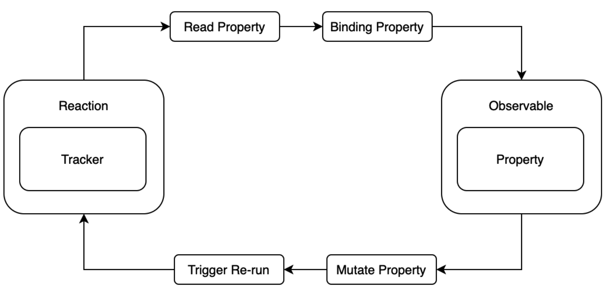

# @formily/reactive

> 面向领域驱动设计 [DDD](https://zhuanlan.zhihu.com/p/109114670) 的响应式状态管理方案，核心理念基于 `mobx`进行定制开发适用于`formily`.

[reactive 官网](https://reactive.formilyjs.org/zh-CN)

## 核心概念

### Observable

> **可订阅对象**, 通过创建一个可订阅对象，在每次操作该对象的属性数据的过程中，会自动通知订阅者。`observable` 对象主要是通过 `ES Proxy` 来创建的，它可以做到完美劫持数据操作。

- observable 函数创建深度 observable 对象
- define 函数定义 observable 领域模型，可以组合 observable 函数与其静态属性(比如 observable.computed)函数完成领域模型的定义
- model 函数定义自动 observable 领域模型，它会将 getter setter 属性包装为 computed 计算属性，将函数包装为 action，将其他数据属性用 observable 包装(注意这里是深劫持)

### Reaction

> reaction 在响应式编程模型中，它就相当于是可订阅对象的订阅者, 它接收一个 tracker 函数，这个函数在执行的时候，如果函数内部有对 observable 对象中的某个属性进行读操作(依赖收集)，那当前 reaction 就会与该属性进行一个绑定(依赖追踪)，知道该属性在其他地方发生了写操作，就会触发 tracker 函数重复执行

### Computed

> computed 是一个可以缓存计算结果的 Reaction

**缓存策略**是：只要 computed 函数内部所依赖的 observable 数据发生变化，函数才会重新执行计算，否则永远读取缓存结果

### Batch 

> 基于 Proxy 劫持, 任何一个原子操作都会触发 Reaction 执行, Batch 是为了对更新操作进行合并，避免频繁触发，浪费性能

## 注意事项

- 尽量少用 observable/observable.deep 进行深度包装，不是非不得已就多用 observable.ref/observable.shallow，这样性能会更好
- 领域模型中多用 computed 计算属性，它可以智能缓存计算结果
- 虽然批量操作不是必须的，但是尽量多用 batch 模式，这样可以减少 Reaction 执行次数
- 使用 autorun/reaction 的时候，一定记得调用 dispose 释放函数(也就是调用函数所返回的二阶函数)，否则会内存泄漏
